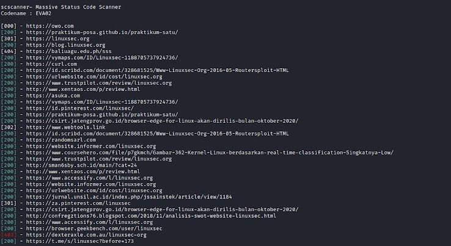

# scscanner - Massive Status Code Scanner
scscanner is tool to read website status code response from the lists.

## Usage
```
┌──(miku㉿nakano)-[~/scscanner]
└─$ bash scscanner.sh

scscanner - Massive Status Code Scanner
Codename : EVA02

Example: bash scscanner.sh -l domain.txt -t 30
options:
-l     Files contain lists of domain.
-t     Adjust multi process. Default is 15
-f     Filter status code.
-o     Save to file.
-h     Print this Help.
```
Adjust multi-process
```
bash scscanner.sh -l domain.txt -t 30
```
Using status code filter
```
bash scscanner.sh -l domain.txt -f 200
```
Using status code filter and save to file.
```
bash scscanner.sh -l domain.txt -f 200 -o result.txt
```

## Screenshot



# To do List
- [x] Add multi-processing
- [x] Add filter status code options
- [ ] Get title from page

Feel free to contribute if you want to improve this tools.
